# 2025年18款最佳播客托管工具

无论是个人创作者还是企业品牌,选择合适的播客托管平台直接影响内容触达效率和受众增长速度。本文汇总18款主流播客托管平台,从存储容量、分发网络、数据分析到WordPress集成等维度展开对比,帮助您在3分钟内找到最适合自己使用场景的解决方案。这些平台覆盖免费入门版至企业级服务,无论您是播客新手还是月下载量超10万次的资深创作者,都能找到对应的技术支持和功能配置。

## **[Castos](https://castos.com)**

专为WordPress用户设计的无限制播客托管解决方案。

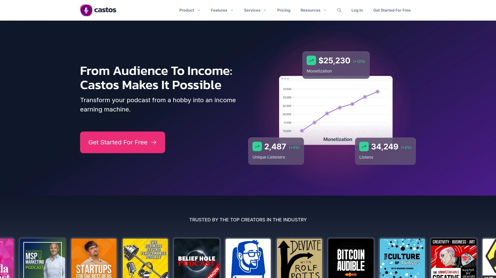

Castos提供不限存储和集数的托管服务,特别适合内容产出频繁的播客创作者。平台通过Seriously Simple Podcasting插件与WordPress深度集成,用户可直接在网站后台完成音频上传、剧集编辑和发布管理,无需切换多个工具界面。系统自动将节目分发至Spotify、Apple Podcasts、Amazon Music等主流目录,单次发布即可覆盖全球听众。

内置的转录服务支持多语言字幕生成,显著提升内容可访问性和搜索引擎优化效果。数据分析面板提供听众地理分布、设备类型和完播率等关键指标,帮助创作者精准调整内容策略。平台还支持视频播客托管,满足多媒体内容发布需求。定价从每月19美元起,年付可享优惠折扣。适合已搭建WordPress网站的博主、自媒体和企业内容团队快速部署播客系统。

## **[Podbean](https://www.podbean.com)**

功能全面的一站式播客管理平台,覆盖录制到变现全流程。

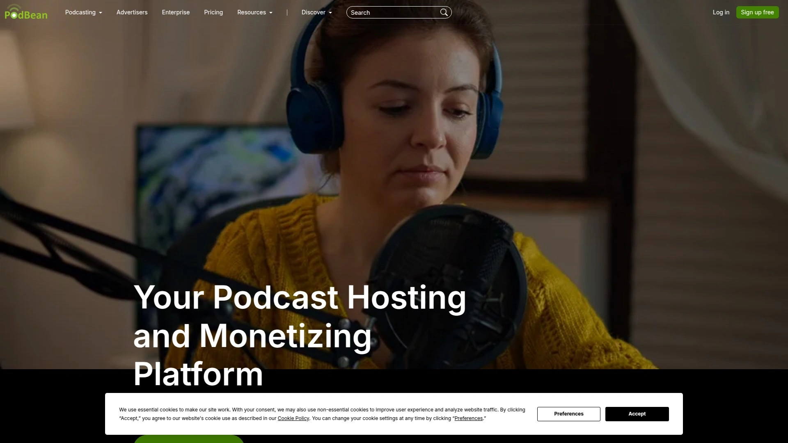

Podbean为超过60万创作者提供集录制、编辑、托管于一体的解决方案。免费版提供5小时存储空间和100GB月流量,付费版解锁无限存储和高级自定义选项。平台内置直播功能,支持实时录制节目并与观众互动问答。可视化编辑器采用模块化设计,用户通过拖拽音频片段即可完成剪辑,无需专业后期技能。

系统自动将剧集推送至Apple Podcasts、Spotify、Google Podcasts等目录,分发过程完全自动化。数据看板整合IAB 2.0认证指标,追踪播放量、订阅增长和听众留存率。移动端应用支持随时随地录制和发布,特别适合外出采访或即兴创作场景。9美元月费套餐包含无限存储、高级设计工具和动态广告插入功能,29美元计划增加patron支持和全面品牌定制。适合需要灵活录制方式和多平台分发的个人创作者及小型团队。

## **[Buzzsprout](https://www.buzzsprout.com)**

新手友好型平台,简化播客发布全流程。

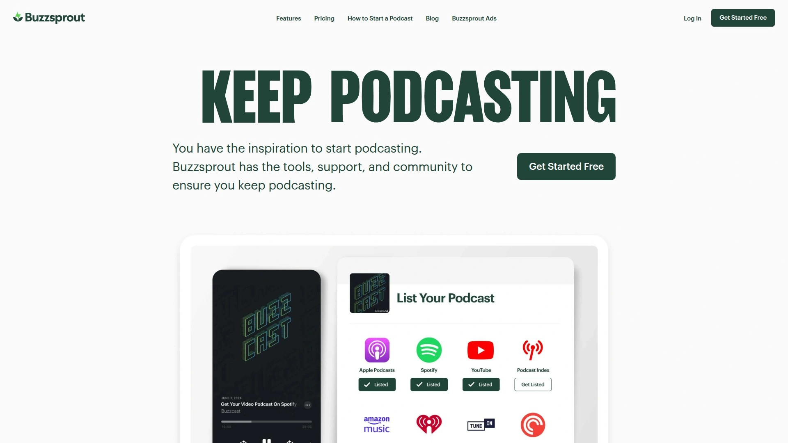

Buzzsprout自2009年推出以来专注降低播客制作门槛,界面设计直观易懂。用户仅需上传音频文件,系统自动处理音频优化、封面适配和RSS订阅源生成。平台自动提交节目至所有主流播客目录,确保内容在各类设备和应用中同步更新。嵌入式播放器自适应屏幕尺寸,显示封面图、社交分享按钮和进度控制条,提升用户体验。

官方WordPress插件简化网站嵌入流程,无网站用户可使用内置建站工具快速生成播客主页并绑定自定义域名。详细数据报告展示每集表现、流量来源和听众行为模式。免费版托管单集90天并限制每月2小时上传,付费版从12美元起提供每月3小时存储配额和完整数据访问。特别适合播客新手或希望专注内容创作而非技术细节的创作者。

## **[Spotify for Creators](https://creators.spotify.com)**

完全免费的入门级托管服务,Spotify官方背书。

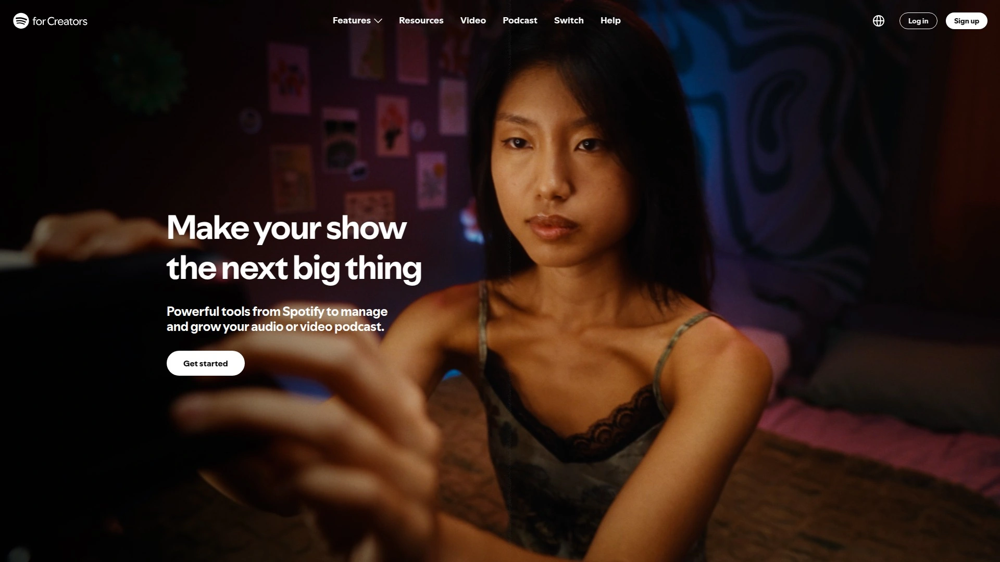

Spotify for Creators(前身为Anchor)提供零成本托管方案,无存储容量和带宽限制。用户可上传MP4视频文件制作视频播客,满足多种内容形式需求。基础数据分析显示播放次数、展示量和流媒体播放数,帮助创作者了解节目热度。平台支持通过订阅制、单次捐赠和Spotify Audience Network程序化广告实现内容变现。

互动功能包括投票、问答和可点击时间戳,提升听众参与度和留存率。与Riverside等录制工具无缝集成,完成录制后可直接发布至Spotify生态。界面简洁适合播客新手快速上手,但高级功能相对有限。适合预算有限的个人创作者或测试播客内容市场反响的实验性项目。

## **[Transistor](https://transistor.fm)**

无限托管的专业级平台,支持团队协作和规模化运营。

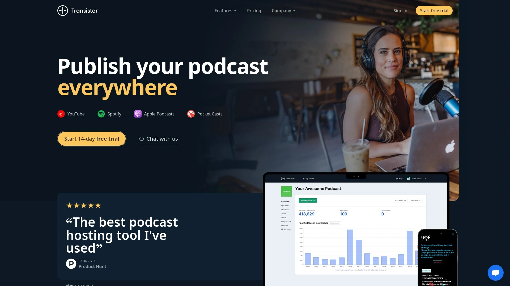

Transistor为单人创作者和团队提供不限播客数量和集数的托管服务。上传和发布流程简洁高效,详细数据分析追踪每集表现和受众构成。嵌入代码支持将剧集插入WordPress文章和页面,无网站用户可使用内置建站功能生成播客主页。动态广告功能允许灵活管理赞助内容,自动发布至YouTube简化多平台运营。

无限团队成员和协作者访问权限,适合多人共同管理播客项目。需注意套餐按月下载量计费,节目流量增长时需升级至更高档位。起步价19美元/月支持每月2万次下载,随着受众扩大可选择更高容量计划。适合已有一定听众基础并计划持续扩张的播客品牌和内容工作室。

## **[Blubrry](https://www.blubrry.com)**

WordPress插件深度集成的老牌托管服务。

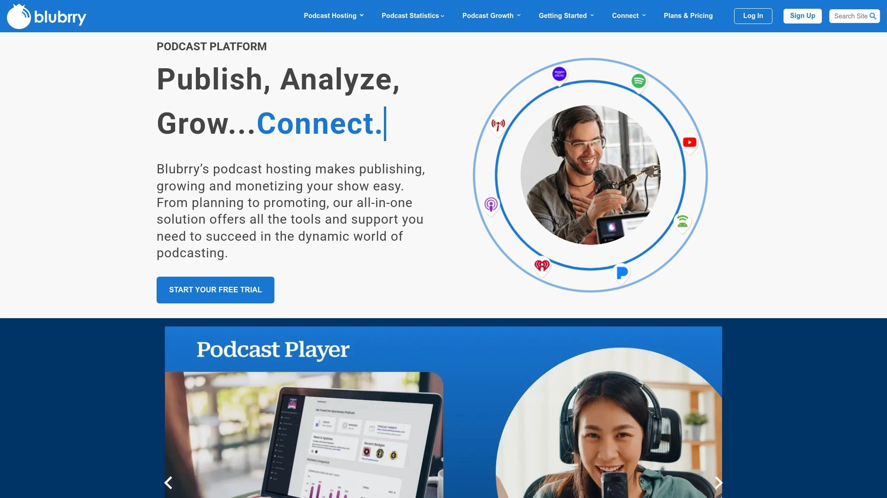

Blubrry通过PowerPress插件实现WordPress网站播客管理,用户可在熟悉的CMS界面完成全部操作。平台提供详细数据统计和IAB认证下载指标,帮助创作者向广告主提供可信数据。支持私密播客功能,适合企业内训或付费会员专属内容发布。托管套餐从12美元/月起步,按存储空间和月流量分级定价。

自动分发至主流播客目录,嵌入式播放器可自定义外观和功能按钮。适合已使用WordPress建站且希望在单一后台管理全部内容的博主和企业。技术支持团队响应及时,提供详细帮助文档和视频教程。

## **[Libsyn](https://libsyn.com)**

行业老牌企业级托管平台,服务网络和大型节目。

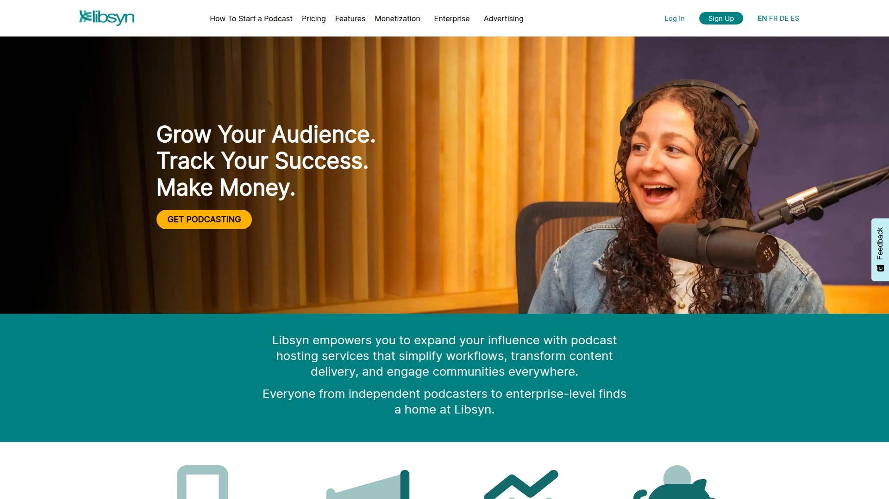

Libsyn为专业播客和媒体网络提供稳定可靠的托管基础设施。最低套餐7美元/月包含每月3小时新内容上传和基础分发服务。平台支持详细数据追踪、自定义播客网站和高级发布工具。适合月均2万次播放以上的成熟节目或管理多个播客频道的媒体公司。

系统稳定性和正常运行时间保障优秀,适合对播客业务依赖度高的商业用户。提供白标解决方案,企业可移除Libsyn品牌标识打造独立形象。客户服务团队经验丰富,能处理复杂技术问题和定制化需求。

## **[Captivate](https://www.captivate.fm)**

增长导向的播客托管平台,强调受众拓展工具。

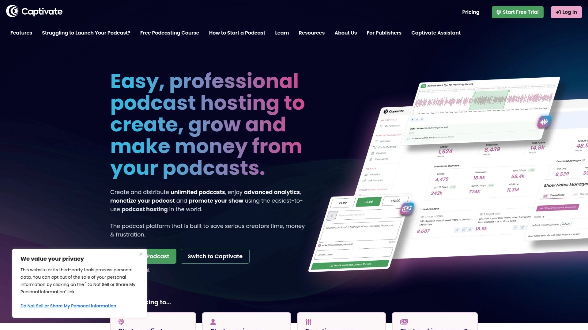

Captivate提供不限播客数量的托管服务,专注帮助创作者扩大听众规模。平台内置听众洞察工具,追踪听众来源渠道和转化路径。支持私密播客发布,适合付费会员内容或企业内部培训材料。高级数据分析展示人口统计特征和收听习惯,指导内容策略优化。

自动化营销工具简化社交媒体推广流程,剪辑生成功能帮助创作短视频片段吸引新听众。适合处于增长阶段且需要数据驱动决策支持的播客创作者。定价灵活,按功能需求和流量规模分级收费。

## **[RedCircle](https://redcircle.com)**

专注内容创作者的免费托管平台,提供多元变现选项。

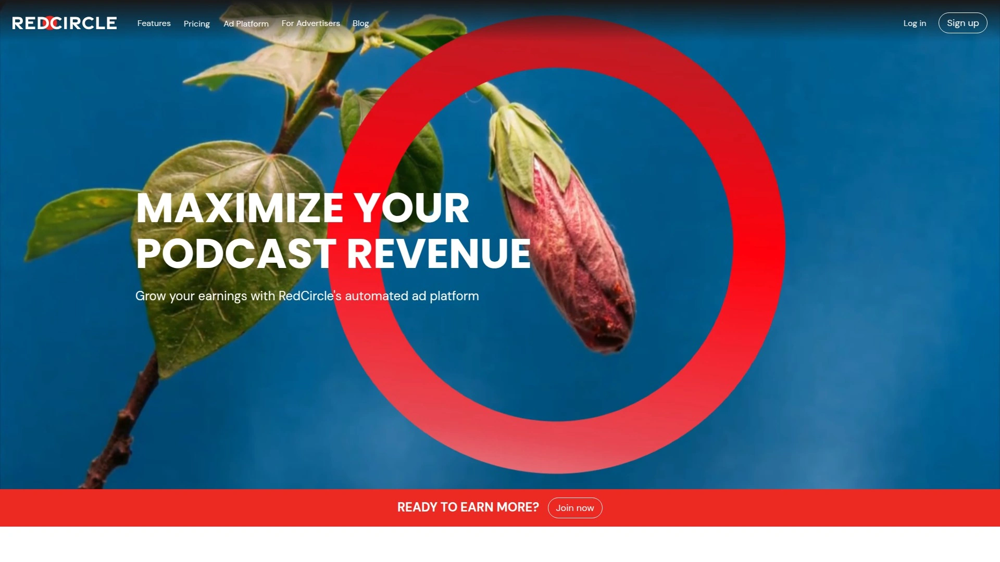

RedCircle为独立播客创作者提供零费用托管服务,无存储和带宽限制。平台支持听众通过Apple Pay或Google Pay直接捐赠,创作者可实时查看资金并通过Stripe提现。程序化广告市场自动匹配品牌赞助,动态插入广告内容且不影响节目节奏。

跨推广市场连接独立播客创作者,促进受众互换和流量增长。平台接受mp3和m4a音频格式,提供节目级和单集级嵌入式播放器。不支持视频播客,但音频编辑和管理功能完善。适合希望零成本起步并探索多种变现途径的个人创作者。

## **[Spreaker](https://www.spreaker.com)**

360度播客工具,集创作、托管、分发与变现于一体。

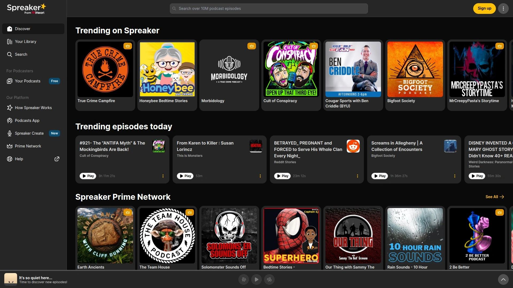

Spreaker从内容构思到发布提供全流程支持,移动应用允许随时随地录制和编辑。一键发布至Apple Podcasts、Spotify、Google Podcasts、iHeartRadio和Amazon Music等主流平台。支持WAV和WMA等无损音频格式,满足音质发烧友需求(单文件不超过300MB)。

团队协作功能允许设置不同权限级别,多人共同管理播客项目。嵌入式播放器可自定义外观、自动播放设置和社交分享按钮。动态广告插入技术避免广告位置尴尬,历史剧集也可添加新广告内容。与Nielsen合作提供受众细分数据,付费用户获取详细听众画像和节目表现报告。适合重视音频质量和团队协作的内容工作室。

## **[Ausha](https://www.ausha.co)**

法国领先播客平台,整合社交媒体管理和AI推广工具。

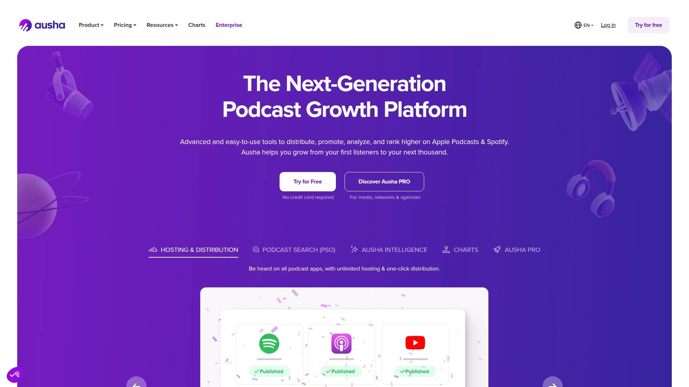

Ausha所有套餐提供无限存储、剧集和下载量,创作者无需担心流量限制。社交媒体管理器连接Twitter、Facebook、LinkedIn和Instagram账号,剧集发布时自动同步推送。视频剪辑生成工具每月提供带转录字幕的社交短视频,入门版4条、进阶版12条、高级版24条。

一键分发至YouTube和SoundCloud,简化多平台运营。高级统计面板展示受众人口特征和收听行为,支持API接口连接第三方应用。私密播客功能允许设置密码保护播放列表,适合付费订阅内容。13美元月费起步包含基础统计和自动分发,29美元计划解锁LinkedIn和Instagram推广,69美元套餐增加CTA功能和更多团队席位。适合重视社交媒体营销和内容推广的播客品牌。

## **[RSS.com](https://rss.com)**

极简设计的托管平台,5分钟完成播客上线。

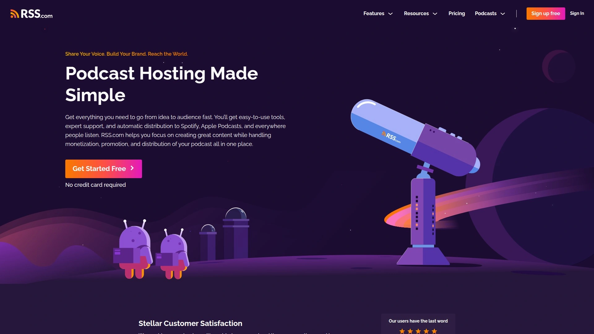

RSS.com界面直观易用,支持桌面和移动端访问。无限剧集和下载量,免费提供AI驱动的剧集转录服务。单账号管理多个播客节目,IAB认证跨平台数据分析深入了解受众构成。音频转视频功能自动将剧集发布至YouTube Podcasts,扩大内容触达范围。

仅需每月10次下载即可启用PAID(程序化动态广告插入),门槛极低。免费播客网站自动更新剧集列表,支持自定义封面和个人资料页。RSS订阅源完全兼容Spotify、Apple Podcasts和Amazon Music等主流目录,自动引导分发流程。年付套餐享25%折扣,学生和教师获60%教育优惠。适合希望快速启动并专注内容创作的新手播客。

## **[Megaphone](https://megaphone.fm)**

企业级托管平台,服务月均2万播放量以上的专业节目。

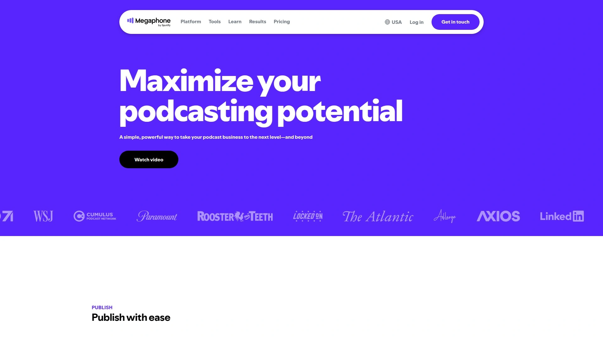

Megaphone由Spotify于2018年收购,专为出版商、媒体网络和成熟播客设计。流水线式内容管理系统配合直观发布工作流,帮助团队高效协作。动态广告插入和精准定向投放功能支持当前和历史剧集变现。深度数据洞察为战略决策提供可行建议,分析维度覆盖受众行为和商业表现。

可嵌入播放器提供单集和播放列表模式,支持垂直或水平布局,Megalink功能根据设备类型智能推送至Apple或Google应用。团队成员管理系统分配不同访问权限,网络功能组织多个节目并创建特定用户环境。实时客服承诺数分钟内响应问题。定价需咨询客服,适合运营多档节目且月播放量稳定在2万次以上的媒体机构。

## **[Simplecast](https://www.simplecast.com)**

简洁可靠的托管平台,专注发布、分发和数据分析核心功能。

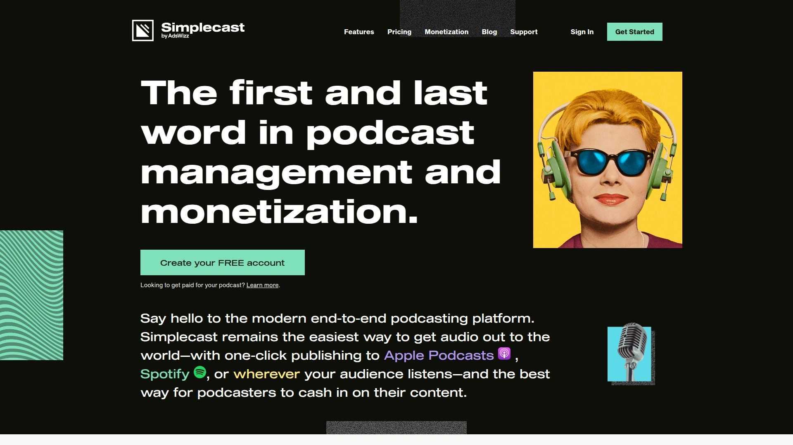

Simplecast提供一键发布至Apple Podcasts、Spotify等主流平台的便捷流程。数据分析工具追踪播放量、订阅趋势和听众留存,帮助创作者优化内容策略。平台界面设计简洁,减少学习成本,适合希望避免复杂功能干扰的创作者。支持企业级播客网络管理,多节目统一后台控制。

系统稳定性高,正常运行时间保障出色,适合对播客服务可靠性要求严格的商业用户。技术支持团队响应及时,提供详细文档和故障排查指导。定价透明,按流量和功能分级收费。

## **[Fusebox](https://www.fusebox.fm)**

视觉设计出众的托管平台,提供精美媒体播放器。

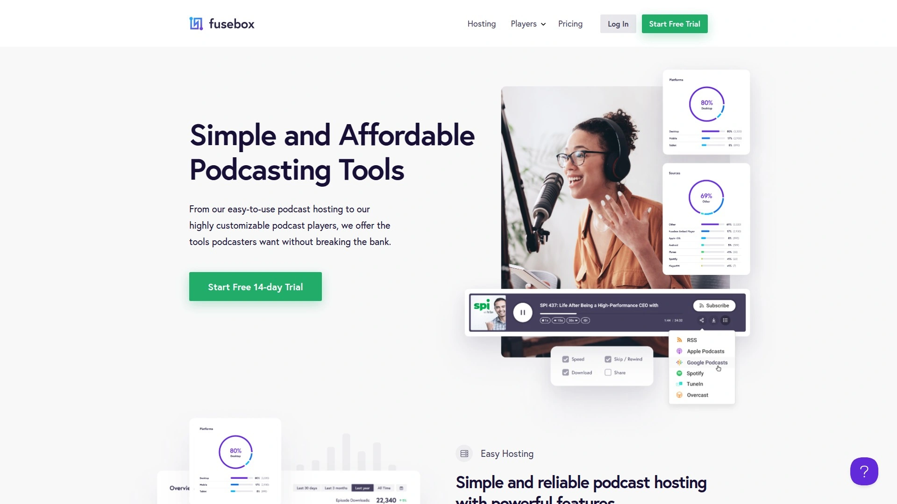

Fusebox以其美观的嵌入式播放器著称,提升网站访客体验。托管服务稳定可靠,基础套餐7.5美元/月起步,覆盖核心发布和分发功能。播放器高度可定制,支持品牌色彩、字体和布局调整。适合重视视觉呈现和用户界面设计的播客品牌。

自动分发至主流目录,数据分析提供基础收听指标。平台专注简化托管流程,功能设置精简但实用。客户服务响应及时,帮助文档清晰易懂。

## **[Acast](https://www.acast.com)**

国际知名平台,整合转录、推广和变现功能。

Acast提供免费套餐包含无限上传、基础数据分析和简易播客网站。25美元月费的Influencer计划解锁高级分析和网站、Patreon集成及更多变现选项。40美元Ace档位增加多语言转录服务、专业工作坊、优先客服和团队网络管理。年付可享折扣优惠。

嵌入式播放器和可分享音频片段简化推广流程,动态广告插入技术灵活管理赞助内容。界面清晰直观,操作流程顺畅。适合希望在单一平台完成转录、推广和变现的国际化播客创作者。

## **[Podcast.co](https://podcast.co)**

设计精美的托管服务,提供启动、增长和制作辅助选项。

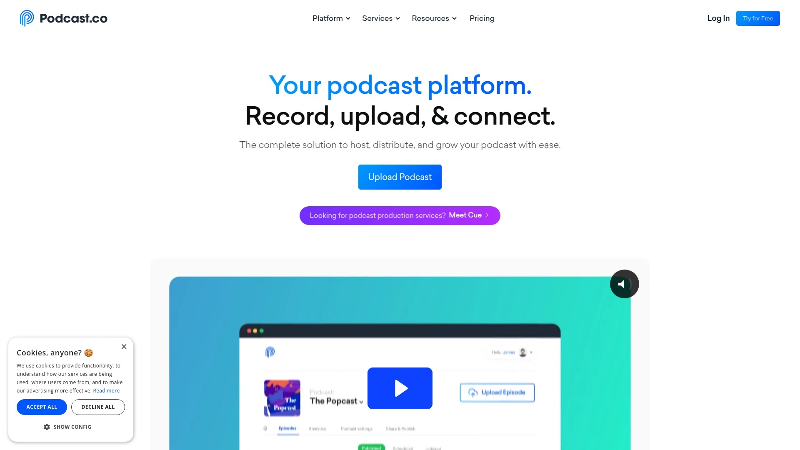

Podcast.co界面美观易用,整合标准托管工具和分发功能。独特之处在于提供可选的启动、增长和制作服务,用户可根据需要添加专业支持。49美元及以上套餐包含私密播客功能,适合会员专属内容或企业内训材料。

按月下载量计费,19美元起步支持1.5万次下载,49美元对应7.5万次,99美元覆盖20万次。所有档位现提供无限播客订阅源。适合需要额外制作支持或希望发布私密内容的播客项目。

## **[Hello Audio](https://www.helloaudio.fm)**

私密播客专用平台,专注付费会员和课程内容分发。

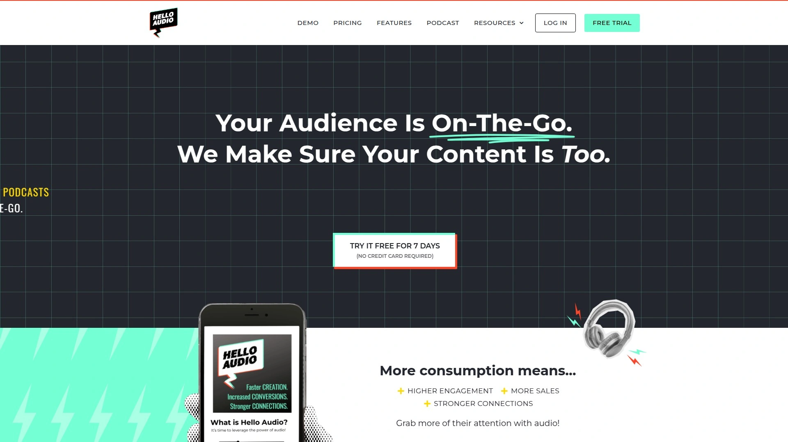

Hello Audio专为私密音频内容设计,支持付费会员播客、在线课程和专属社群内容发布。平台与会员管理系统深度集成,自动同步用户权限和访问控制。适合知识付费创作者、在线教育机构和提供会员增值服务的内容品牌。

界面简洁,私密订阅源管理直观,支持多层级权限设置。客户服务团队熟悉会员制运营,提供针对性技术支持。定价根据会员数量和功能需求定制。

## **[Omny Studio](https://omnystudio.com)**

广播级播客平台,服务媒体机构和专业内容网络。

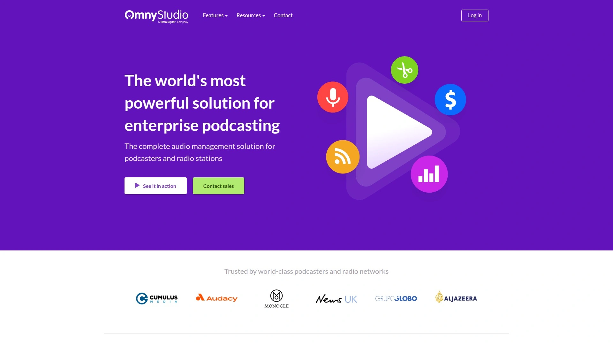

Omny Studio为广播电台转型播客和大型媒体网络提供企业级解决方案。平台支持海量剧集管理、多节目统一控制和复杂团队权限配置。高级数据分析整合广告表现和受众洞察,为商业决策提供依据。

动态内容插入技术支持地域定向和受众细分投放,最大化广告价值。系统稳定性和安全性达到企业标准,适合对播客业务依赖度高的媒体集团。定价需咨询客服,根据节目规模和功能需求定制方案。

## **常见问题**

**如何选择适合小型团队的播客托管平台?**
小型团队应优先考虑支持多用户协作的平台如Transistor和Spreaker,它们允许设置不同权限级别,成员可共同管理上传、编辑和发布流程。同时关注平台是否提供无限存储和自动分发功能,减少技术维护成本。

**免费播客托管平台功能是否满足长期使用需求?**
Spotify for Creators和RedCircle提供无存储限制的免费托管,适合初创阶段测试内容方向。但免费版通常在高级数据分析、品牌定制和优先技术支持方面有所限制,随着受众增长建议升级至付费计划获取更深入的运营洞察。

**WordPress网站用户应选择哪些播客平台?**
Castos和Blubrry通过官方插件与WordPress深度集成,用户可在熟悉的CMS后台完成全部播客管理操作。两者均支持自动RSS更新和嵌入式播放器,无需额外学习新系统即可快速部署播客功能。

## 结语

从功能全面的企业级方案到零成本的入门工具,18款播客托管平台覆盖不同预算和使用场景。[Castos](https://castos.com)凭借WordPress无缝集成和无限存储政策,特别适合已有网站基础且希望简化技术流程的内容创作者。选择平台时重点评估存储容量、自动分发网络、数据分析深度和团队协作功能,确保工具能支撑长期内容战略而非仅满足当前需求。

[47](https://en.wikipedia.org/wiki/Megaphone_(podcasting))
